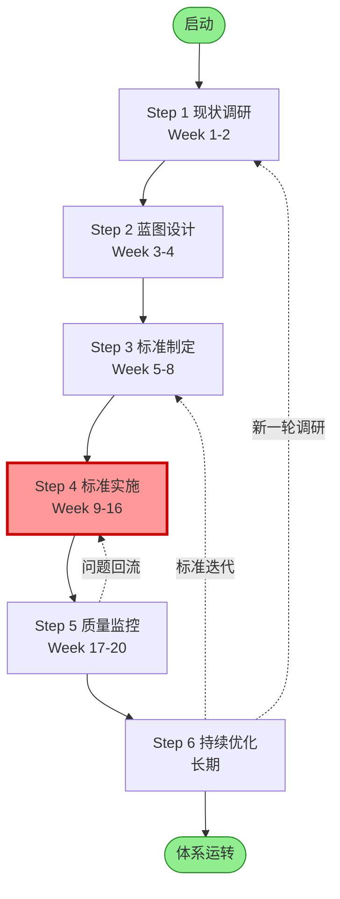

# 数据治理六步法

## 📌 一句话定义

将数据治理从"运动式整改"变为"体系化推进"的六个标准步骤：**现状调研 → 蓝图设计 → 标准制定 → 标准实施 → 质量监控 → 持续优化**。

## 🎯 适用场景

- 金融机构首次建立企业级数据治理体系
- 监管检查后需要系统性整改数据质量问题
- 准备 DCMM 等级认证（3级→4级）
- 数据标准、数据质量、数据安全等领域需要统筹落地
- 多个数据治理项目并行，需要统一方法论和语言

## 💡 核心价值

| 价值 | 说明 | 典型效果 |
|:-----|:-----|:--------|
| **有章法** | 按六步推进，避免东一榔头西一棒槌 | 项目返工率↓50% |
| **能落地** | 每个步骤有明确交付物和验收标准 | 项目按时交付率↑40% |
| **可度量** | 每阶段设定量化目标，便于跟踪 | 进度透明度↑ |
| **可持续** | 第六步建立长效机制，避免项目结束就倒退 | 治理成果保持率↑ |

## 📋 六步法总览

| 步骤 | 周期 | 核心目标 | 关键交付物 | 详细指南 |
|:----:|:----:|:--------|:----------|:--------|
| **① 现状调研** | Week 1-2 | 摸清数据家底，识别痛点和风险 | 现状调研报告、问题清单、优先级排序 | [[方法论-治理六步法-Step1现状调研\|查看详情]] |
| **② 蓝图设计** | Week 3-4 | 设计治理架构、组织机制、实施路线图 | 治理蓝图方案、组织架构、标准框架 | [[方法论-治理六步法-Step2蓝图设计\|查看详情]] |
| **③ 标准制定** | Week 5-8 | 制定第一批可执行的数据标准 | 数据标准规范、标准管理办法 | [[方法论-治理六步法-Step3标准制定\|查看详情]] |
| **④ 标准实施** | Week 9-16 | 将标准落地到系统和流程 | 系统改造方案、数据清洗方案、测试报告 | [[方法论-治理六步法-Step4标准实施\|查看详情]] |
| **⑤ 质量监控** | Week 17-20 | 建立常态化监控和闭环机制 | 质量监控体系、检核规则、问题处理流程 | [[方法论-治理六步法-Step5质量监控\|查看详情]] |
| **⑥ 持续优化** | 长期 | 建立长效机制，持续提升治理能力 | 复盘机制、标准迭代机制、考核机制 | [[方法论-治理六步法-Step6持续优化\|查看详情]] |

## 🔍 每步一句话总结

### Step 1：现状调研
**"先知道自己在哪，再决定往哪走。"**

通过资料收集、访谈、系统扫描，全面摸清组织架构、数据资产、数据质量、制度体系现状，输出《现状调研报告》和《TOP 10 问题清单》。

### Step 2：蓝图设计
**"没有蓝图就开工，等于闭着眼睛盖楼。"**

设计三层治理组织架构（委员会/管理办公室/执行团队）、数据标准体系框架、技术架构和实施路线图，明确第一阶段落标范围。

### Step 3：标准制定
**"标准是尺子，但尺子必须大家都能用。"**

选择第一批高优先级标准（建议 5-10 个），组建跨部门标准制定小组，明确每个标准的业务定义、技术规范、质量规则和管理流程。

### Step 4：标准实施
**"标准写在纸上是废纸，落到系统里才是资产。"**

这是六步法中最难、最关键的一步。选定试点系统，制定系统改造方案和数据清洗方案，完成开发、测试、上线、验收全流程。

### Step 5：质量监控
**"没有监控的标准，三天就变形。"**

建立检核规则层、监控执行层、问题处理层、报告展示层四层监控体系，实现数据质量问题的自动发现、分级告警、闭环处理。

### Step 6：持续优化
**"治理不是项目，是长期运营。"**

建立周例会、月度评估、季度复盘、年度总结机制，持续迭代标准和流程，将数据质量纳入绩效考核。

### 常用模板
| 步骤 | 核心模板 |
|:-----|:--------|
| Step 1 | [[模板-数据治理现状调研报告]] |
| Step 2 | [[模板-数据标准框架设计]]、[[模板-字段级认责台账]] |
| Step 3 | [[模板-标准内容起草]]、[[模板-影响分析文档]] |
| Step 4 | [[模板-标准映射文档]]、[[模板-测试验收报告]] |
| Step 5 | [[模板-数据质量监控体系]]、[[模板-数据质量检核规则]]、[[模板-数据问题处理闭环流程]] |
| Step 6 | [[模板-数据质量报告]]、[[模板-数据质量考核方案]] |

## 📊 实施节奏建议

### 最小可行周期（MVP）
适合首次试点、资源有限的团队：

| 阶段 | 周期 | 产出 |
|:-----|:----:|:-----|
| 现状调研 | 1 周 | 问题清单（TOP 10） |
| 蓝图设计 | 1 周 | 组织架构 + 第一批标准范围 |
| 标准制定 | 2 周 | 3-5 个核心标准 |
| 标准实施 | 4 周 | 1 个试点系统落标 |
| 质量监控 | 2 周 | 10 条核心检核规则上线 |
| 持续优化 | 长期 | 月度复盘机制 |

### 标准周期（推荐）
适合有专职治理团队、希望一次做透的机构：

| 阶段 | 周期 | 产出 |
|:-----|:----:|:-----|
| 现状调研 | 2 周 | 完整调研报告 |
| 蓝图设计 | 2 周 | 治理蓝图 + 3 年规划 |
| 标准制定 | 4 周 | 10-20 个标准 V1.0 |
| 标准实施 | 8 周 | 3-5 个系统落标 |
| 质量监控 | 4 周 | 完整监控体系 |
| 持续优化 | 长期 | 季度复盘 + 年度考核 |

## ⚠️ 常见陷阱

| 陷阱 | 表现 | 正确做法 |
|:-----|:-----|:--------|
| **跳过调研直接干** | 凭经验做方案，发现业务痛点不对 | 必须花 1-2 周做扎实调研 |
| **蓝图画太大** | 第一批就想治理全公司所有数据 | 聚焦 1-2 个业务域，先赢一战 |
| **标准闭门造车** | IT 部门自己写标准，业务部门不认可 | 每个标准必须有业务 Owner 参与 |
| **实施没试点** | 全面推进，一处失败全线崩塌 | 先选 1 个配合度高、影响大的系统试点 |
| **监控流于形式** | 规则很多，问题没人处理 | 建立问题闭环 SLA，纳入考核 |
| **项目结束就解散** | 团队散了，标准没人维护 | 建立专职治理团队，长期运营 |

## ❓ 常见问题

- [[问题-业务部门不配合怎么办]]
- [[问题-技术团队说工作量大怎么办]]
- [[问题-历史数据清洗难怎么办]]
- [[问题-标准执行不下去怎么办]]
- [[问题-Owner不认责-业务部推脱]]

## 📚 参考标准

- DCMM 数据管理能力成熟度评估模型（GB/T 36073-2018）
- DAMA-DMBOK2 数据管理知识体系指南

